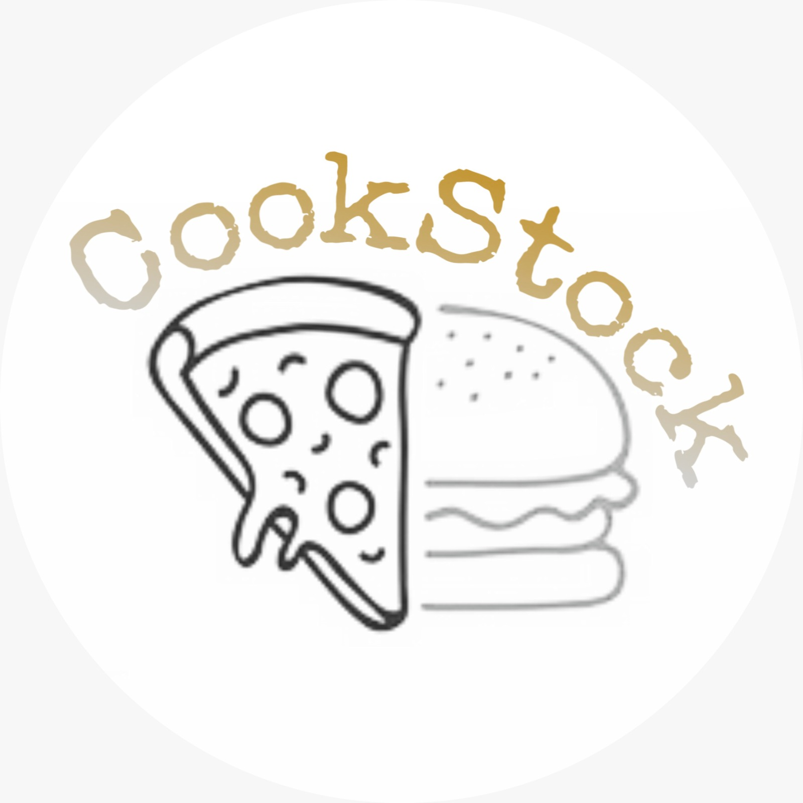

# CookStock

  

## Cosa fa il progetto
Il nostro sito web si occupa della gestione di un pub, che comprende le attività di consegna a
domicilio, asporto e ordinazione per consumazione sul posto. Il nostro pub si occupa del
reparto pizzeria, reparto panineria e reparto friggitoria. Gli utenti a cui tale sito si rivolge sono
i consumatori finali, che intendono effettuare un ordine sul nostro sito.

## Cosa serve per eseguire il progetto
- IntelliJ IDEA
- Server Web Apache Tomcat

## Membri del team
- Lo Conte Simona (matr. 0512110922)
- Napolillo Marta (matr. 0512109836)

